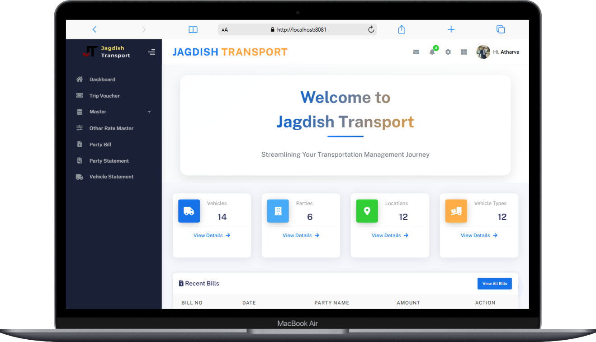
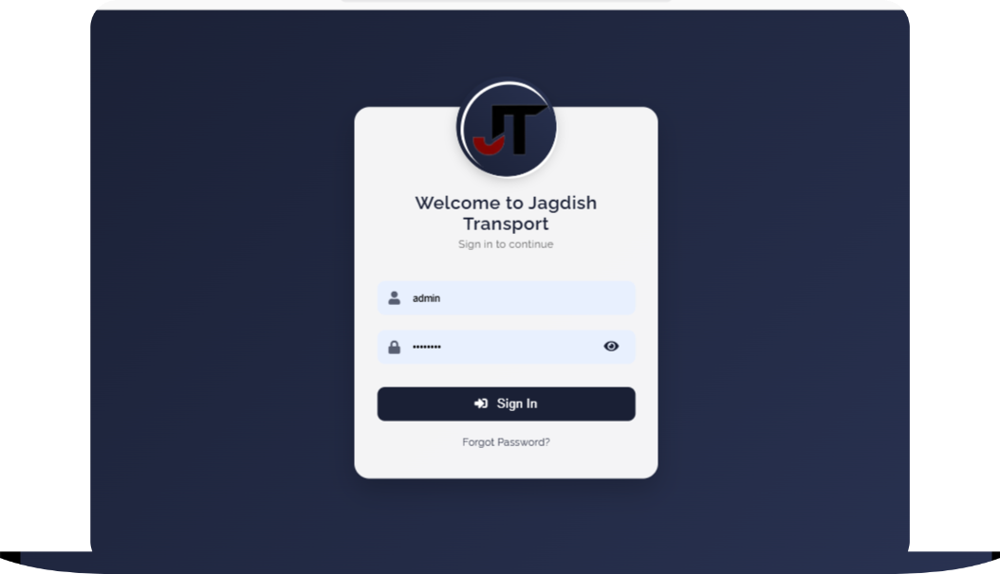
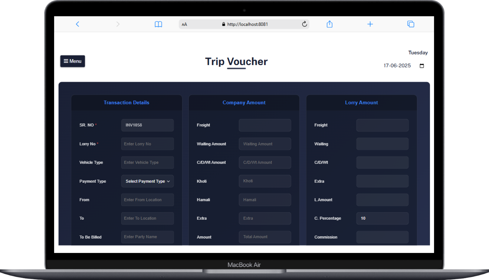
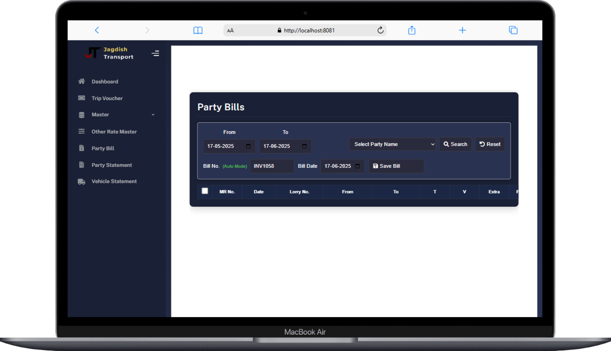
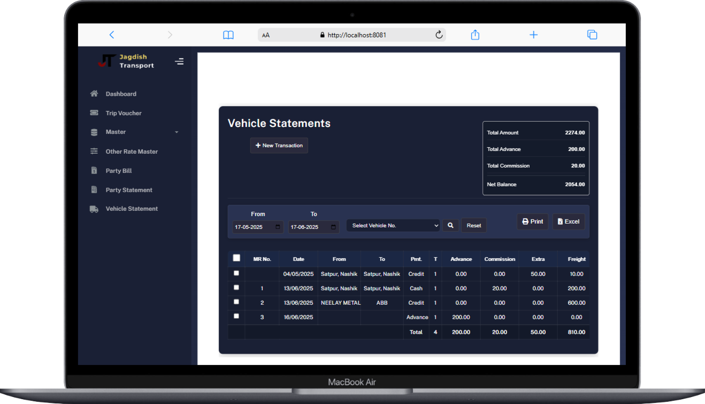

<div align="center">
  
  <h1>🚚 Jagdish Transport Management System 🚚</h1>
  <p><b>A comprehensive web-based application designed to automate and manage the day-to-day operations of a transport company</b></p>
  
</div>

---
<br/>
<div align="center">
  
  
  
  
  
</div>

---
## ✨ Features
<ul>
  <li>🚗 <b>Vehicle Management</b> - Register, track, categorize vehicles and manage maintenance schedules</li>
  <li>🛣️ <b>Trip Management</b> - Create vouchers, manage routes, and record trip details</li>
  <li>💰 <b>Billing & Invoicing</b> - Generate bills, configure settings, and track payments</li>
  <li>👥 <b>Customer Management</b> - Maintain customer records and track transactions</li>
  <li>🔐 <b>User Management</b> - Secure authentication and role-based access control</li>
  <li>📊 <b>Dashboard & Reporting</b> - View KPIs and generate various reports</li>
</ul>

---
## 🖼️ Screenshots

<div align="center">
  
  
  
  
</div>

---
## 🛠️ Technology Stack

<div align="center">
  <h3>Backend</h3>
  
  
  
  
  
  
  <h3>Frontend</h3>
  
  
  
  
  
  
  <h3>Additional Tools</h3>
  
  
  
  
</div>

---
## 🚀 Getting Started

<ol>
  <li><b>Clone the repository</b>
    <pre><code>git clone https://github.com/Atharva-2510/Jagdish-Transport.git
cd Jagdish-Transport</code></pre>
  </li>
  <li><b>Configure the database</b>
    <ul>
      <li>Create a MySQL database named <code>jagdishtransport_db</code></li>
      <li>Update the database credentials in <code>src/main/resources/application.properties</code></li>
    </ul>
    <pre><code>spring.datasource.url=jdbc:mysql://localhost:3306/jagdishtransport_db?createDatabaseIfNotExist=true
spring.datasource.username=your_mysql_username
spring.datasource.password=your_mysql_password</code></pre>
  </li>
  <li><b>Configure email settings (for notifications)</b>
    <pre><code>spring.mail.username=your_email@gmail.com
spring.mail.password=your_app_password</code></pre>
  </li>
  <li><b>Build the application</b>
    <pre><code>mvn clean install</code></pre>
  </li>
  <li><b>Run the application</b>
    <pre><code>mvn spring-boot:run</code></pre>
    The application will be available at <code>http://localhost:8081</code>
  </li>
</ol>

---
## 📂 Project Structure

```text
src/main/java/com/example/JagdishTransport/
├── Config/                  # Configuration classes
├── Controller/              # Web controllers
├── dto/                     # Data Transfer Objects
├── model/                   # Entity classes
├── repository/              # Data access interfaces
├── service/                 # Business logic
│   └── impl/                # Service implementations
└── JagdishTransportApplication.java  # Main application class
```

---
## 🔒 Security

<ul>
  <li>🔐 <b>Form-based authentication</b></li>
  <li>🔑 <b>BCrypt password encoding</b></li>
  <li>👮 <b>Role-based access control</b></li>
  <li>🛡️ <b>CSRF protection</b></li>
</ul>

---
## 🗄️ Database

The application uses MySQL with JPA/Hibernate for data persistence. The database schema is automatically created and updated using Hibernate's `ddl-auto=update` feature.

---
## 👥 Contributing

<ol>
  <li>Fork the repository</li>
  <li>Create your feature branch (<code>git checkout -b feature/amazing-feature</code>)</li>
  <li>Commit your changes (<code>git commit -m 'Add some amazing feature'</code>)</li>
  <li>Push to the branch (<code>git push origin feature/amazing-feature</code>)</li>
  <li>Open a Pull Request</li>
</ol>

---  
## 📬 Contact  

<p align="center">  
  <a href="https://github.com/Atharva-2510/Jagdish-Transport/graphs/contributors">  
      
  </a>  
</p>    

<p align="center">  
  <a href="mailto:atharvapimparkar1416@gmail.com">  
      
  </a>  
  <a href="https://github.com/Atharva-2510">  
      
  </a>  
  <a href="https://www.linkedin.com/in/atharva-pimparkar">  
      
  </a>  
</p>  

<p align="center">  
  <a href="mailto:akhilesh0222r@gmail.com">  
      
  </a>  
  <a href="https://github.com/Akhilesh-2024">  
      
  </a>  
  <a href="https://www.linkedin.com/in/akhilesh2022">  
      
  </a>  
</p>  

---

## 📄 License

<p align="center">
  
</p>
<p align="center">This project is licensed under the MIT License - see the LICENSE file for details.</p>
